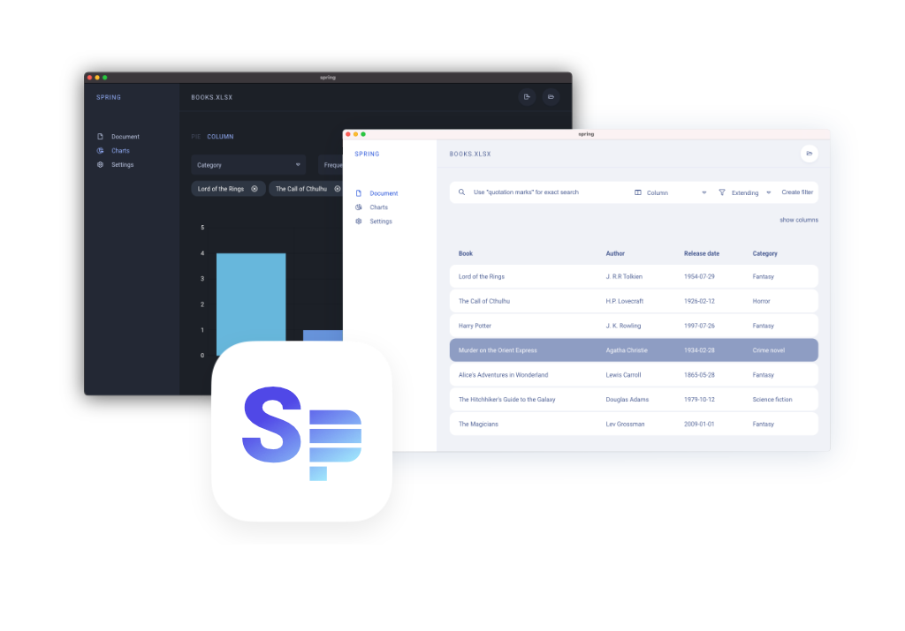

<center>

Spring is an Electron made excel file viewer. It allows you to view your `.xslx` files, filter visible rows and easily preview a variety of graphs with one simple click. The app was developed by Martin Roček for a project by Josef Vacek, who also provided the funding for the development of this app.

</center>
<br>
<br>
<br>
<br>

# What is suported and what is not?
At the moment the app allows only single work-sheet `.xlsx` files. It can process as much as 2000 rows without any noticeable lags. I've also tested even larger data files with success. It expects that the first row in your `.xslx` file will be the table header.

<br>

# Installation
Download the right package for your OS in the [releases](https://github.com/silencesys/spring/releases) section and simply extract the app or follow the installation instructions. Builds for MacOS are signed and thus the installation should be without any problem. Sadly, that can not be said about Windows builds, as I'm not a Windows developer, builds are not signed and thus you'll be prompted with a SmartScreen warning - you can safely proceed, or compare SHA which is present at each
download tag.

<br>

# How to use Spring

First of all you need to open `.xslx` file, which can be done from the context menu or by clicking on the rounded folder button at the right side of the app window.

## Configuration of the app

### File settings
The configuration is divided into two sections. First is document based and can be set for each opened document differently. The first settings is a multi-value column which defines columns that might contain one or more values. From the app:

> These columns with more than one value should be marked by the prefix #: in the source file. Example: 1: value. Using a multi-value column allows you to connect multiple values in one row. Example: if you have two people in one column - 1: person; 2:person, you can assign another value from the same row, for example colour of clothes - 1: red; 2: blue. The graph automatically differentiates the values and shows person 1 as wearing red, person 2 as wearing blue. It isn't necessary to fill in both values, for example only person 1 is wearing red, while person 2 isn't described.

Thus you can mark some of the columns in your document as multi-valued if your columns contain more than one value or should be merged with other columns in the same row. The next option is to set data type for some of the columns. At the moment only
`date` is supported and it allows you to see data on the timeline in the bar chart section.

### Application settings
There are the standard settings as theme or localization, and there is also the option to allow filter sharing from the document section to the chart section. This helps you see charts for the part of the data that interests you the most.

## Document section

Upon opening the file, you should see a table with all the rows from your file. In the upper part of the content window is a filter field, where you can set filters which are applied on the rows. To create a filter, you need to type a term in to the search field - it is recommended to write a single word or part of a word, phrases are not supported in this version. Simple workaround for phrases is to use comma to separate each word in search. Then you choose one of the columns in your document and decide whether the filter should be `extending` or `specifying`.

- **Extending filters** will include every row that meets at least one condition of all the set filters.
- **Specifying filters** will include only those rows that met all the conditions of all the set filters.

After this, hit the button **create filter** and it will be automatically applied on all the rows in the document. Thus if your document exceeds the limitation of the renderer, which is 500 rows, and only 100 rows from the whole document meets the filter criteria, all these rows will be shown.

## Chart section
In the chart section it is possible to preview charts with a few clicks. The app supports only the **pie** and **column** charts at the moment. In the pie chart you can combine different views for two chosen columns. The same applies to the column charts with a few important differences. Column charta support the frequency column which allows you to see the frequency of a phenomena. The other difference is the possibility to see the chosen phenomena on a timeline if you set the `date` data type on some of the columns in the settings. In case you have too many values (shown as tags) in the bar chart, there is a xsmall arrow in the right corner which can be draged to make the field with values (tags) smaller.

Every chart can be easily exported with one simple click. The export button is located near the rounded open button at the top of the application.

<br>

# Development
The app uses [Vue CLI Plugin Electron Builder](https://nklayman.github.io/vue-cli-plugin-electron-builder/) thus can be modified as any other JavaScript application.

### Project setup
First you need to clone this repository, then install dependencies via Node package manager.

```bash
git clone https://github.com/silencesys/spring.git spring
cd spring
npm install
```

### Compiles and hot-reloads for development
As this is a Vue.js project, you can use Webpack server within the Electron window by running command:
```
npm run electron:serve
```

### Compiles and minifies for production
When you're done with all changes, simply run following command to build the app. Builded app will be available in the `dist` directory.
```
npm run electron:build
```

<br>

# Contributions
All contributions are welcomed, however give me some time to review your requests.
